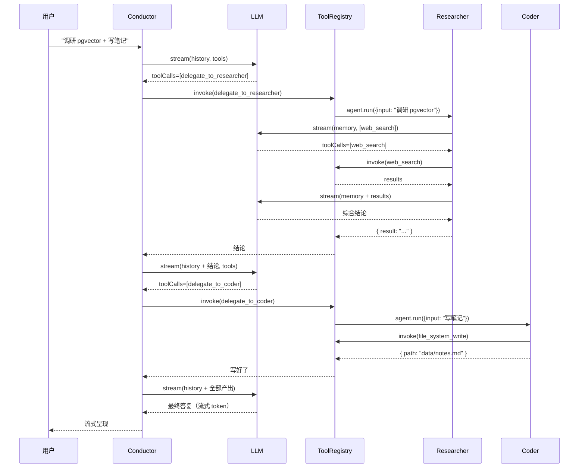

<div align="center">

# 🤖 TuttiKit

### 自己跑、自己改、自己说了算的简易多 Agent 框架

<p>
  
  
  
  
  
  
  
  
  
</p>

<p>
  <strong>给团队 / 个人的「能跑通就能改造」AI 助手底盘</strong><br/>
  Claude / OpenAI / DeepSeek 任选（含 fallback chain） · Plan-and-Execute · 图片 PDF 解析 · MCP 协议 · 50+ 个 Claude Code Skill 开箱即用 · 跨设备同步 · Budget 守卫 · 35+ Eval 任务
</p>

```
git clone <repo> && cd tuttikit && pnpm install && pnpm dev
                                                                 ↓
                                  💻 http://localhost:3000 + 📱 http://192.168.x.x:3000
```

</div>

---

## ✨ 它能干啥（一图看完）

```
┌──────────────────────────────────────────────────────────────────────┐
│  你：「调研下 pgvector，把要点写到 ./data/notes.md，再帮我审一遍」    │
└─────────────────────────┬────────────────────────────────────────────┘
                          ▼
┌──────────────────────────────────────────────────────────────────────┐
│                  🎩 Conductor 主对话 Agent                           │
│                                                                      │
│  💭 想：这是「调研 + 落地 + 审查」三步走                              │
│  → 调用 delegate_to_researcher ─┐                                    │
│                                  ▼                                   │
│                          🔍 Researcher Agent                         │
│                             调 web_search                            │
│                             综合结论 → 返回                          │
│                                  │                                   │
│  ← 拿到结论 ────────────────────┘                                    │
│  → 调用 delegate_to_coder ──────┐                                    │
│                                  ▼                                   │
│                          ✍️ Coder Agent                              │
│                             调 file_system_write                     │
│                             落盘 → 返回                              │
│                                  │                                   │
│  ← 写好了 ──────────────────────┘                                    │
│  → 调用 delegate_to_reviewer ───┐                                    │
│                                  ▼                                   │
│                          🧑‍⚖️ Reviewer Agent                          │
│                             调 file_system_read                      │
│                             评分 + 建议 → 返回                       │
│                                  │                                   │
│  ← 评审完成 ────────────────────┘                                    │
│  📝 给用户综合回复（流式 token）                                     │
└──────────────────────────────────────────────────────────────────────┘
```

**节点数量与内容完全由 LLM 实时决定**，不是预设阶段。简单问答 1 步搞定；复杂任务自动展开三层嵌套。

---

## 🎯 核心能力一览

<table>
<tr>
<td width="50%" valign="top">

### 🤖 Agent 编排
- 主 Agent 自动决策、按需委派 3 个 sub-agent
- **Plan-and-Execute V2**：拆步执行 + 失败 re-plan
- **Self-Critique**：终答前内省审校
- **Agent as Tool** 模式（Claude Code 同款）
- 嵌套 Trace 完整记录 + Replay（A/B 多 provider）

### 🧠 多 Provider + 韧性
- Anthropic / OpenAI / DeepSeek / Mock
- **Fallback chain**：主限流自动切备
- **Retry + 指数退避**（429 / 5xx）
- **AbortController 全链路**：用户 stop 立即中断 tool

### 💰 成本守卫
- BudgetGuard 单会话 / 当日 USD 上限
- **Anthropic prompt cache**：输入价 -90%
- LLM 响应缓存（dev 用）
- 单价表 + 跨 model 前缀匹配

### 📎 多模态
- 图片 OCR（tesseract.js）+ PDF 抽取（pdf-parse v2）
- `<user-attachment>` 隔离防 prompt injection
- 60k 字符截断防 context 爆

</td>
<td width="50%" valign="top">

### 📚 Skills（开箱 50+ 个）
- 兼容 Claude Code + 软链 + plugin marketplace
- `find_skills` / `invoke_skill` 内置
- **`/skills` 管理页** + 中文翻译落盘 + 列表名批量翻
- `↻ Reload` 不重启进程

### 🔗 MCP（含信任边界）
- stdio + HTTP/SSE 两种传输
- **`trusted: false` 强制 allowTools 白名单**
- `/mcp` 管理页 + 单 server `↻ Reconnect`
- tool desc 翻译落盘

### ⚡ `/` 直接调
- 输入框打 `/` 弹面板
- 50+ skill + 所有 MCP tool 实时过滤
- 选完自动 inject prompt 模板

### 🔒 安全
- Helmet 头 + SSE 限流
- fileSystem 写 allowlist + denylist
- pre-commit hook 拦敏感文件 / API key

### 📱 桌面 + 移动端
- 三套主题（dark / light / 系统）
- 全管理页虚拟滚动（VirtualList 零依赖）
- 多设备实时同步 + 扫码即进 + iOS 重连

### 📊 评测
- **35+ Eval 任务**，9 个分类，LLM-as-judge + regression diff
- `--fail-on-regression` CI 门禁
- A/B 多 provider 对比

</td>
</tr>
</table>

---

## 🚀 5 分钟跑起来

<details>
<summary><strong>📦 安装</strong>（点击展开）</summary>

```bash
# 准备：Node 18+ / pnpm 9+
git clone <repo>
cd tuttikit
pnpm install
```

</details>

<details>
<summary><strong>⚙️ 配 .env（可选）</strong></summary>

```bash
cp apps/server/.env.example apps/server/.env
```

`apps/server/.env` 里填一个就行（DeepSeek 最便宜，几块钱跑通整套）：

```env
LLM_PROVIDER=deepseek
DEEPSEEK_API_KEY=sk-...

# 或 Anthropic（多模态最强）
# LLM_PROVIDER=anthropic
# ANTHROPIC_API_KEY=sk-ant-...

# 或 OpenAI
# LLM_PROVIDER=openai
# OPENAI_API_KEY=sk-...
```

**不配也能跑** —— 自动 fallback 到 Mock provider 演示整条流水线。

</details>

<details>
<summary><strong>🏁 启动</strong></summary>

```bash
pnpm dev
```

输出：

```
┌───────────────────────────────────────────────────────────
│  tuttikit — 已就绪
│
│  前端        http://localhost:3000    ← 浏览器进这个
│  后端        http://localhost:3001    ← API + SSE
│  局域网  📱  http://192.168.x.x:3000   ← 手机用这个
│
│  按 Ctrl+C 停止全部
└───────────────────────────────────────────────────────────
```

打开 `http://localhost:3000` 就完了。手机扫码即进。

</details>

---

## 🎨 长这样

```
┌─ 会话列表 ─┬─ 标题  Provider ▾  ctx 1.3k/65k ────────────┬─ QR ─┐
│ + 新建对话 │                                              │ ▣▣▣▣ │
│ ◆ 对话 A   │  你 · 14:33                                  │ ▣ ▣▣ │
│   对话 B   │  调研 pgvector 并把要点写到 ./data/notes.md  │ ▣▣▣  │
│   对话 C   │                                              └──────┘
│   ⋮        │  AI · 14:33
│            │  好的，我先用 Researcher 调研一下。
│            │  ┌─ 🔧 delegate_to_researcher  完成  ›  ─┐
│            │  │ Input  { goal: "调研 pgvector" }      │
│            │  │ Output { ... }                         │
│            │  └────────────────────────────────────────┘
│            │  ┌─ 🔧 delegate_to_coder  完成  ›  ──────┐
│            │  │ Input  { goal: "写要点到 ..." }       │
│            │  │ Output { path: "data/notes.md" }      │
│            │  └────────────────────────────────────────┘
│            │  已完成 ✓ 文件写好了，要点见 `./data/notes.md`
│            │
│ ─ traces ─ │  ─────────────────────────────────────────
│ ─ memory ─ │  [+] [发送消息...]                  🎤  📨
└────────────┴──────────────────────────────────────────────────────
```

---

## 🆚 跟别的比

| | tuttikit | Claude Code | LangChain |
| --- | :-: | :-: | :-: |
| 开源可改 | ✅ | ❌ | ✅ |
| 换模型 | 任意 + fallback chain | 锁 Anthropic | 任意 |
| 多 Agent 委派 | ✅ 内置 3 个 sub-agent | ✅ | ⚙️ 自己拼 |
| Plan-and-Execute | ✅ V2 显式 step + re-plan | ⚙️ 主要 ReAct | ⚙️ LangGraph 拼 |
| Skills 兼容 | ✅ 直接读 `.claude/skills/` + plugins | ✅ 原生 | ❌ |
| MCP 接入（含信任边界） | ✅ stdio + HTTP + trusted/allowTools | ✅ | ⚙️ 自己拼 |
| Web UI（含管理页） | ✅ /skills /mcp /traces + 中文翻译 | ❌（CLI） | ❌ |
| `/` slash 命令 | ✅ skills + MCP 强制调 | ✅ | ❌ |
| 多设备同步 | ✅ SSE 全局广播 | ❌ | ❌ |
| Budget 守卫 | ✅ USD / token 上限 + 预警 | ⚙️ | ❌ |
| Eval Harness | ✅ 35+ tasks + judge + regression | ❌ | ⚙️ 自己拼 |
| Trace + A/B Replay | ✅ 自建 + 多 provider 对比 | ⚙️ | ⚙️ LangSmith |
| 部署难度 | `pnpm dev` / Docker compose | n/a | 自己搭 |
| 代码量 | **~12k 行**（含 eval + 管理页 + 翻译） | 闭源 | 几万行 |

---

## 🔥 重点特性深潜

<details>
<summary><strong>🎭 Conductor + 3 个 Sub-Agent 是怎么协作的</strong></summary>



**关键设计：sub-agent 包装成 `delegate_to_*` 工具，主 agent 看到的世界就是"工具"，无特殊编排逻辑。** 这正是 Claude Code / Codex 的实际实现方式。

</details>

<details>
<summary><strong>📚 Skills 怎么用（无缝兼容 Claude Code）</strong></summary>

```bash
# 把任何 Claude Code 风格的 skill 扔进项目
mkdir -p .claude/skills/translate-en-zh
cat > .claude/skills/translate-en-zh/SKILL.md << 'EOF'
---
name: translate-en-zh
description: 把英文段落翻成自然的中文，保持术语准确
---
你是一个英译中专家。原则：
1. 技术词保留英文（如 React、pgvector），不强翻
2. 句式按中文习惯重组，不直译
3. 输出只给译文，不加说明
EOF

# 重启服务
pnpm dev
```

启动日志会看到：
```
[skills] 加载完成 { count: 1, names: ["translate-en-zh"] }
```

之后跟模型说「帮我翻这段」，它会自动 `find_skills` → `invoke_skill` 加载指南。

</details>

<details>
<summary><strong>🔗 MCP 怎么接</strong></summary>

```bash
# 复制范例
cp .mcp.json.example .mcp.json
```

编辑 `.mcp.json`：

```json
{
  "mcpServers": {
    "filesystem": {
      "command": "npx",
      "args": ["-y", "@modelcontextprotocol/server-filesystem", "/path/to/files"]
    },
    "my-api": {
      "url": "https://my-server.com/mcp",
      "headers": { "Authorization": "Bearer ..." }
    }
  }
}
```

重启服务，工具自动以 `mcp__filesystem__read_file` 等名字出现在 Conductor 工具表。`curl localhost:3001/mcp` 看连接状态。

</details>

<details>
<summary><strong>📱 移动端怎么实时同步</strong></summary>

后端跑一条全局事件广播 SSE（`/events`）。每次 session CRUD / turn 结束 → 推到所有连着的客户端：

```
PC 发完消息
  ↓ 服务端落盘 + emit broadcaster.sessionUpdated(sid)
  ↓
全局 SSE 推给所有 /events 长连接
  ↓
手机 useGlobalSync 收到 session:updated
  ↓ 不是自己发起的 → reloadCurrent()
  ↓
手机 UI 自动追加新消息
```

iOS 切回前台主动断重连（不依赖 onerror），30s 心跳超时也会重连。手机扫桌面右下角 QR 即进。

</details>

<details>
<summary><strong>🎨 移动端优化都做了哪些</strong></summary>

- ✅ 响应式：≤720px 自动汉堡 + 抽屉式侧栏
- ✅ 触屏左滑关侧栏
- ✅ 触摸目标 ≥40×40
- ✅ iOS 输入框 font-size: 16px（防自动放大）
- ✅ `100dvh` 适配 Safari 工具栏伸缩
- ✅ 删 Google Fonts CDN（国内首屏快 5-30s）
- ✅ Mermaid IntersectionObserver 懒载（首屏省 ~600KB）
- ✅ Chunk 失配自动 reload（dev 模式不再白屏）
- ✅ Chinese 文件名 multer `defParamCharset:'utf8'`
- ✅ QR 浮窗自己扫自己（页面右下角）

</details>

---

## 📊 这项目有多大

```
后端 TypeScript     60+ 个 .ts 文件  ≈ 7000 行（agent + 工具 + LLM + eval + planner + budget + RAG）
前端 TypeScript     20+ 个组件 + 6 个 hook + 3 管理页  ≈ 3500 行
样式（globals.css） 1 个文件  ≈ 2200 行（dark + light + system + 响应式）
─────────────────────────────────────────────────────────────
单元测试            10 套 ~200 断言，全过
端到端 Eval         35+ tasks，9 个分类，mock 100% 通过
First Load JS       ~110 KB（生产构建）
```

**全栈代码 ~12k 行，一周读完，照着改无压力。**

---

## 🛣️ 路线图

**v0.2 全部 7 大方向已落地**：

| 方向 | 状态 | 主要产出 |
| --- | :-: | --- |
| #1 Eval Harness | ✅ | 35+ tasks + LLM-as-judge + regression diff + CI 门禁 |
| #2 RAG | ✅ | Embedding + 混合检索 RRF + dedup + cluster summarization |
| #3 Resilience | ✅ | Zod + 自修复 + withRetry + Provider fallback + AbortController |
| #4 Planning | ✅ | Plan-and-Execute V1/V2 + Self-Critique + Auto-Review |
| #5 Cost & Budget | ✅ | BudgetGuard + Pricing + Anthropic prompt cache + LLMCache |
| #6 Safety | ✅ | Helmet + SSE 限流 + write allowlist + injection 隔离 + pre-commit hook |
| #7 Deployment | ✅ | Dockerfile + env 校验 + /ready + drain + Trace Replay（含 A/B）|
| 延伸 | ✅ | Skills/MCP 翻译 + 三个管理页 + `/` slash 命令 + VirtualList |

详见 [`docs/agent-roadmap/`](./docs/agent-roadmap/) 11 篇方案。

**还没做（明显的下一步）**：

| 想加的 | 价值 |
| --- | --- |
| 真 LLM eval baseline | 跑一次真 provider 建首个 baseline（要 API key + 钱） |
| sqlite-vec 持久化 | > 10k 条目时该上（迁移文档已就绪） |
| 更多 provider（智谱/通义/Gemini） | aisdk.ts 加 case |
| 真 web 搜索（Tavily/Serper） | 替换 webSearch.ts |
| 多用户鉴权 | 团队/公司场景 |

---

## 🧪 跑测试

```bash
pnpm -C apps/server test
# 10 套测试 ~200 断言：
#   ✓ aisdk        AI SDK 集成（消息映射 / tool-call / 流式）
#   ✓ conductor    多轮 + delegate
#   ✓ markdown     mermaid 三态 / 代码高亮 / escape
#   ✓ skills       SKILL.md 扫盘 + 优先级 + plugin 来源
#   ✓ mcp          stdio in-memory transport + ToolSpec
#   ✓ resilience   ToolInputError 自修复 + Fallback + AbortSignal
#   ✓ safety       fileSystem allowlist + denylist + 路径越界
#   ✓ budget       pricing 表 + BudgetGuard + LLMCache
#   ✓ rag          MockEmbedding + 混合检索 + dedup + compact + VectorStore
#   ✓ planner      shouldPlan + planTask + revisePlan

pnpm -C apps/server eval                                              # mock，35+ 任务
pnpm -C apps/server eval --provider=anthropic --fail-on-regression    # CI 门禁
```

---

## 📚 文档结构

| 文档 | 看啥 |
| --- | --- |
| [README.md](./README.md) | 60 秒上手 + 端口 + 完整 API 表 + Web 管理页 + CLI |
| [OVERVIEW.md](./OVERVIEW.md) | 项目能力 + 优势 + 适合谁 + 路线图（详版） |
| [STRUCTURE.md](./STRUCTURE.md) | 「我想做 X」→「改这些文件」一键定位（核心） |
| [apps/server/ARCHITECTURE.md](./apps/server/ARCHITECTURE.md) | 后端模块详解 / Agent 协议 / Trace 设计 |
| [apps/server/eval/README.md](./apps/server/eval/README.md) | Eval Harness 使用指南 |
| [docs/agent-roadmap/](./docs/agent-roadmap/) | 7 大方向设计文档 + 真 LLM eval workflow + sqlite-vec 迁移 |

---

## 🤝 贡献

```bash
# 改完跑一下
pnpm --filter @tuttikit/server typecheck
pnpm -C apps/server test    # 10 套
pnpm -C apps/server eval    # 35+ 任务
pnpm --filter @tuttikit/web build
```

10 套测试 + 35 eval + typecheck + web build 都过 = 可以 PR。

**提交前**：装下 pre-commit hook 防泄密：
```bash
ln -sf ../../scripts/pre-commit.sh .git/hooks/pre-commit
```

---

<div align="center">

### 喜欢就 Star 一下 ⭐

**先跑通，再改造，是这个项目的态度。**

[⬆ 回到顶部](#-tuttikit)

</div>
