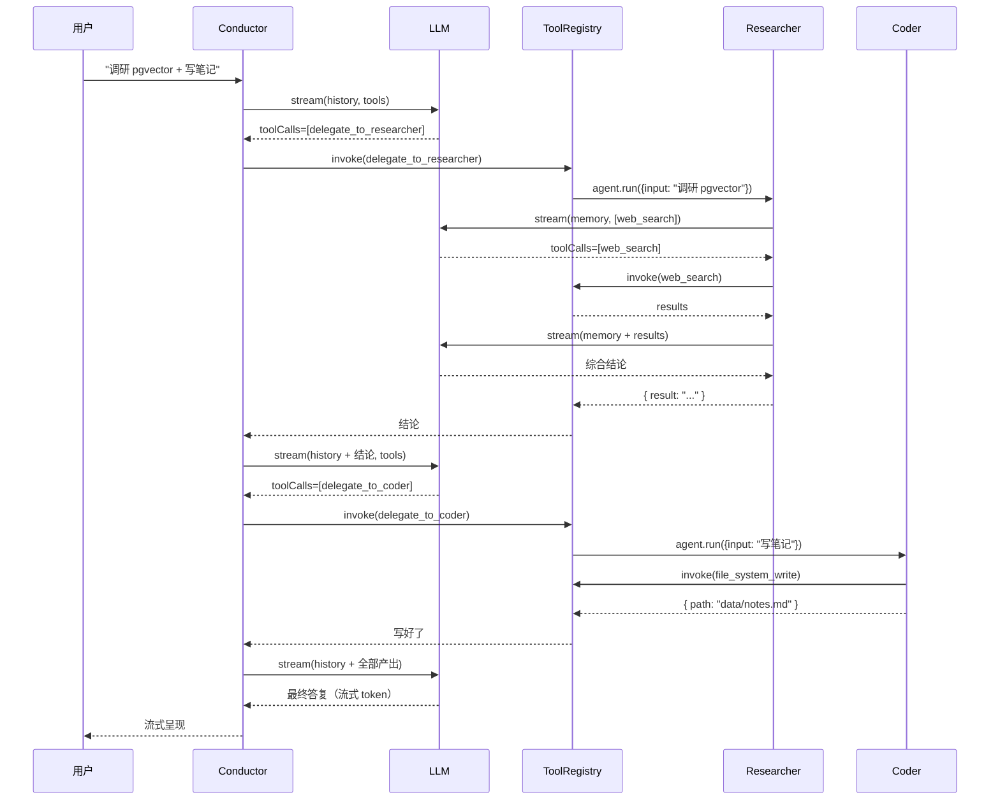

<div align="center">

# 🤖 TuttiKit

### 自己跑、自己改、自己说了算的简易多 Agent 框架

<p>
  
  
  
  
  
  
  
</p>

<p>
  <strong>给团队 / 个人的「能跑通就能改造」AI 助手底盘</strong><br/>
  Claude / OpenAI / DeepSeek 任选 · 图片 PDF 解析 · MCP 协议 · Claude Code 同款 Skill · 跨设备同步
</p>

```
git clone <repo> && cd tuttikit && pnpm install && pnpm dev
                                                                 ↓
                                  💻 http://localhost:3000 + 📱 http://192.168.x.x:3000
```

</div>

---

## ✨ 它能干啥（一图看完）

```
┌──────────────────────────────────────────────────────────────────────┐
│  你：「调研下 pgvector，把要点写到 ./data/notes.md，再帮我审一遍」    │
└─────────────────────────┬────────────────────────────────────────────┘
                          ▼
┌──────────────────────────────────────────────────────────────────────┐
│                  🎩 Conductor 主对话 Agent                           │
│                                                                      │
│  💭 想：这是「调研 + 落地 + 审查」三步走                              │
│  → 调用 delegate_to_researcher ─┐                                    │
│                                  ▼                                   │
│                          🔍 Researcher Agent                         │
│                             调 web_search                            │
│                             综合结论 → 返回                          │
│                                  │                                   │
│  ← 拿到结论 ────────────────────┘                                    │
│  → 调用 delegate_to_coder ──────┐                                    │
│                                  ▼                                   │
│                          ✍️ Coder Agent                              │
│                             调 file_system_write                     │
│                             落盘 → 返回                              │
│                                  │                                   │
│  ← 写好了 ──────────────────────┘                                    │
│  → 调用 delegate_to_reviewer ───┐                                    │
│                                  ▼                                   │
│                          🧑‍⚖️ Reviewer Agent                          │
│                             调 file_system_read                      │
│                             评分 + 建议 → 返回                       │
│                                  │                                   │
│  ← 评审完成 ────────────────────┘                                    │
│  📝 给用户综合回复（流式 token）                                     │
└──────────────────────────────────────────────────────────────────────┘
```

**节点数量与内容完全由 LLM 实时决定**，不是预设阶段。简单问答 1 步搞定；复杂任务自动展开三层嵌套。

---

## 🎯 核心能力一览

<table>
<tr>
<td width="50%" valign="top">

### 🤖 多 Agent 协作
- 主 Agent 自动决策、按需委派
- **Agent as Tool** 模式（Claude Code 同款）
- ReAct 循环 / 流式 / 可中断
- 嵌套 Trace 完整记录每次 turn

### 🧠 模型可换
- Anthropic Claude 3.5+
- OpenAI GPT-4o
- DeepSeek（最便宜）
- Mock 离线（无 Key 也能演示）

### 📎 多模态
- **图片 OCR**（tesseract.js，中英双语）
- **PDF 抽取**（pdf-parse v2，50 页毫秒级）
- 拖拽 / 粘贴 / 文件选择三种入口
- 不支持原生多模态的 LLM 自动收文本

</td>
<td width="50%" valign="top">

### 📚 Skills（本地工作流）
- **完全兼容 Claude Code skills**
- `.claude/skills/<name>/SKILL.md` 即扫即用
- `find_skills` / `invoke_skill` 工具内置
- 项目级 + 用户全局两层

### 🔗 MCP 协议
- stdio + HTTP/SSE 两种传输
- 一个 `.mcp.json` 接所有远端工具
- 工具名 `mcp__<server>__<tool>` 与 Claude Code 一致
- 失败跳过、不阻断启动

### 📱 桌面 + 移动端
- 暗色 OLED 风格，响应式
- **页面右下角 QR**，手机扫码即进
- 多设备实时同步（PC 发 → 手机 3s 内显示）
- iOS 切回前台主动重连

</td>
</tr>
</table>

---

## 🚀 5 分钟跑起来

<details>
<summary><strong>📦 安装</strong>（点击展开）</summary>

```bash
# 准备：Node 18+ / pnpm 9+
git clone <repo>
cd tuttikit
pnpm install
```

</details>

<details>
<summary><strong>⚙️ 配 .env（可选）</strong></summary>

```bash
cp apps/server/.env.example apps/server/.env
```

`apps/server/.env` 里填一个就行（DeepSeek 最便宜，几块钱跑通整套）：

```env
LLM_PROVIDER=deepseek
DEEPSEEK_API_KEY=sk-...

# 或 Anthropic（多模态最强）
# LLM_PROVIDER=anthropic
# ANTHROPIC_API_KEY=sk-ant-...

# 或 OpenAI
# LLM_PROVIDER=openai
# OPENAI_API_KEY=sk-...
```

**不配也能跑** —— 自动 fallback 到 Mock provider 演示整条流水线。

</details>

<details>
<summary><strong>🏁 启动</strong></summary>

```bash
pnpm dev
```

输出：

```
┌───────────────────────────────────────────────────────────
│  tuttikit — 已就绪
│
│  前端        http://localhost:3000    ← 浏览器进这个
│  后端        http://localhost:3001    ← API + SSE
│  局域网  📱  http://192.168.x.x:3000   ← 手机用这个
│
│  按 Ctrl+C 停止全部
└───────────────────────────────────────────────────────────
```

打开 `http://localhost:3000` 就完了。手机扫码即进。

</details>

---

## 🎨 长这样

```
┌─ 会话列表 ─┬─ 标题  Provider ▾  ctx 1.3k/65k ────────────┬─ QR ─┐
│ + 新建对话 │                                              │ ▣▣▣▣ │
│ ◆ 对话 A   │  你 · 14:33                                  │ ▣ ▣▣ │
│   对话 B   │  调研 pgvector 并把要点写到 ./data/notes.md  │ ▣▣▣  │
│   对话 C   │                                              └──────┘
│   ⋮        │  AI · 14:33
│            │  好的，我先用 Researcher 调研一下。
│            │  ┌─ 🔧 delegate_to_researcher  完成  ›  ─┐
│            │  │ Input  { goal: "调研 pgvector" }      │
│            │  │ Output { ... }                         │
│            │  └────────────────────────────────────────┘
│            │  ┌─ 🔧 delegate_to_coder  完成  ›  ──────┐
│            │  │ Input  { goal: "写要点到 ..." }       │
│            │  │ Output { path: "data/notes.md" }      │
│            │  └────────────────────────────────────────┘
│            │  已完成 ✓ 文件写好了，要点见 `./data/notes.md`
│            │
│ ─ traces ─ │  ─────────────────────────────────────────
│ ─ memory ─ │  [+] [发送消息...]                  🎤  📨
└────────────┴──────────────────────────────────────────────────────
```

---

## 🆚 跟别的比

| | tuttikit | Claude Code | LangChain |
| --- | :-: | :-: | :-: |
| 开源可改 | ✅ | ❌ | ✅ |
| 换模型 | 任意 | 锁 Anthropic | 任意 |
| 多 Agent 委派 | ✅ 内置 3 个 sub-agent | ✅ | ⚙️ 自己拼 |
| Skills 兼容 | ✅ 直接读 `.claude/skills/` | ✅ 原生 | ❌ |
| MCP 接入 | ✅ stdio + HTTP | ✅ | ⚙️ 自己拼 |
| Web UI | ✅ 现成 + 移动端 | ❌（CLI） | ❌ |
| 多设备同步 | ✅ | ❌ | ❌ |
| 部署难度 | `pnpm dev` 一条命令 | n/a | 自己搭 |
| 代码量 | **~4.8k 行** | 闭源 | 几万行 |

---

## 🔥 重点特性深潜

<details>
<summary><strong>🎭 Conductor + 3 个 Sub-Agent 是怎么协作的</strong></summary>



**关键设计：sub-agent 包装成 `delegate_to_*` 工具，主 agent 看到的世界就是"工具"，无特殊编排逻辑。** 这正是 Claude Code / Codex 的实际实现方式。

</details>

<details>
<summary><strong>📚 Skills 怎么用（无缝兼容 Claude Code）</strong></summary>

```bash
# 把任何 Claude Code 风格的 skill 扔进项目
mkdir -p .claude/skills/translate-en-zh
cat > .claude/skills/translate-en-zh/SKILL.md << 'EOF'
---
name: translate-en-zh
description: 把英文段落翻成自然的中文，保持术语准确
---
你是一个英译中专家。原则：
1. 技术词保留英文（如 React、pgvector），不强翻
2. 句式按中文习惯重组，不直译
3. 输出只给译文，不加说明
EOF

# 重启服务
pnpm dev
```

启动日志会看到：
```
[skills] 加载完成 { count: 1, names: ["translate-en-zh"] }
```

之后跟模型说「帮我翻这段」，它会自动 `find_skills` → `invoke_skill` 加载指南。

</details>

<details>
<summary><strong>🔗 MCP 怎么接</strong></summary>

```bash
# 复制范例
cp .mcp.json.example .mcp.json
```

编辑 `.mcp.json`：

```json
{
  "mcpServers": {
    "filesystem": {
      "command": "npx",
      "args": ["-y", "@modelcontextprotocol/server-filesystem", "/path/to/files"]
    },
    "my-api": {
      "url": "https://my-server.com/mcp",
      "headers": { "Authorization": "Bearer ..." }
    }
  }
}
```

重启服务，工具自动以 `mcp__filesystem__read_file` 等名字出现在 Conductor 工具表。`curl localhost:3001/mcp` 看连接状态。

</details>

<details>
<summary><strong>📱 移动端怎么实时同步</strong></summary>

后端跑一条全局事件广播 SSE（`/events`）。每次 session CRUD / turn 结束 → 推到所有连着的客户端：

```
PC 发完消息
  ↓ 服务端落盘 + emit broadcaster.sessionUpdated(sid)
  ↓
全局 SSE 推给所有 /events 长连接
  ↓
手机 useGlobalSync 收到 session:updated
  ↓ 不是自己发起的 → reloadCurrent()
  ↓
手机 UI 自动追加新消息
```

iOS 切回前台主动断重连（不依赖 onerror），30s 心跳超时也会重连。手机扫桌面右下角 QR 即进。

</details>

<details>
<summary><strong>🎨 移动端优化都做了哪些</strong></summary>

- ✅ 响应式：≤720px 自动汉堡 + 抽屉式侧栏
- ✅ 触屏左滑关侧栏
- ✅ 触摸目标 ≥40×40
- ✅ iOS 输入框 font-size: 16px（防自动放大）
- ✅ `100dvh` 适配 Safari 工具栏伸缩
- ✅ 删 Google Fonts CDN（国内首屏快 5-30s）
- ✅ Mermaid IntersectionObserver 懒载（首屏省 ~600KB）
- ✅ Chunk 失配自动 reload（dev 模式不再白屏）
- ✅ Chinese 文件名 multer `defParamCharset:'utf8'`
- ✅ QR 浮窗自己扫自己（页面右下角）

</details>

---

## 📊 这项目有多大

```
后端 TypeScript     33 个 .ts 文件  ≈ 3000 行
前端 TypeScript     13 个组件 + 4 个 hook  ≈ 1800 行
样式（globals.css） 1 个文件  ≈ 1400 行（OLED 暗色 + 响应式）
─────────────────────────────────────────────
测试断言            84 个全过（5 套测试套件）
First Load JS       125 KB（生产构建）
```

**全栈代码 5000 行不到，一周读完，照着改无压力。**

---

## 🛣️ 路线图

| 状态 | 想加的 | 价值 |
| :-: | --- | --- |
| ⏳ 待做 | **RAG / 向量记忆** | 长期记忆从关键词换 embedding |
| ⏳ 待做 | **更多 provider**（智谱/通义/Gemini） | 多用户场景 |
| ⏳ 待做 | **真实 web 搜索**（Tavily / Serper） | 离线知识库 → 实时网络 |
| ⏳ 待做 | **Trace 可视化 UI** | 看嵌套调用树 |
| ⏳ 待做 | **Docker / Vercel 一键部署** | 云上 5 分钟 |
| ⏳ 待做 | **多用户鉴权** | 团队/公司场景 |
| ⏳ 待做 | **Skill marketplace** | 社区共享 skill |

每条都有「改哪些文件」的查找表，见 [`STRUCTURE.md`](./STRUCTURE.md)。

---

## 🧪 跑测试

```bash
pnpm test
# 5 套断言全过：
#   ✓ AI SDK 集成        21 断言（消息映射 / tool-call / 流式）
#   ✓ Conductor 多轮      12 断言（delegate / 工具调度）
#   ✓ Markdown 渲染      34 断言（mermaid 三态 / 代码高亮 / escape）
#   ✓ Skills loader        9 断言（frontmatter / 优先级 / 检索）
#   ✓ MCP 集成             8 断言（in-memory transport / listTools / callTool）
#                       = 84
```

---

## 📚 文档结构

| 文档 | 看啥 |
| --- | --- |
| [README.md](./README.md) | 60 秒上手 + 端口 + 关键 API |
| [OVERVIEW.md](./OVERVIEW.md) | 项目能力 + 优势 + 适合谁 + 路线图（详版） |
| [STRUCTURE.md](./STRUCTURE.md) | 「我想做 X」→「改这些文件」一键定位（核心） |
| [apps/server/ARCHITECTURE.md](./apps/server/ARCHITECTURE.md) | 后端模块详解 / Agent 协议 / Trace 设计 |
| [docs/superpowers/specs/](./docs/superpowers/specs/) | 历次设计 spec |

---

## 🤝 贡献

```bash
# 改完跑一下
pnpm --filter @tuttikit/server typecheck
pnpm test
pnpm --filter @tuttikit/web build
```

84 个断言都过 + typecheck exit 0 + web build 通过 = 可以 PR。

---

<div align="center">

### 喜欢就 Star 一下 ⭐

**先跑通，再改造，是这个项目的态度。**

[⬆ 回到顶部](#-tuttikit)

</div>
